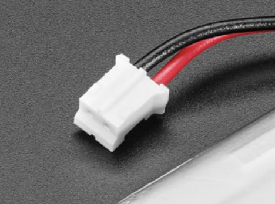
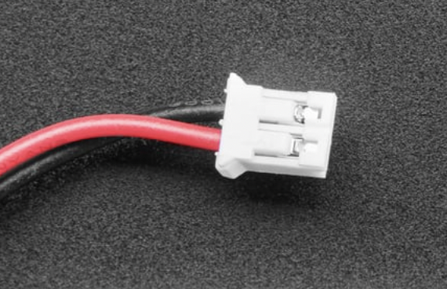
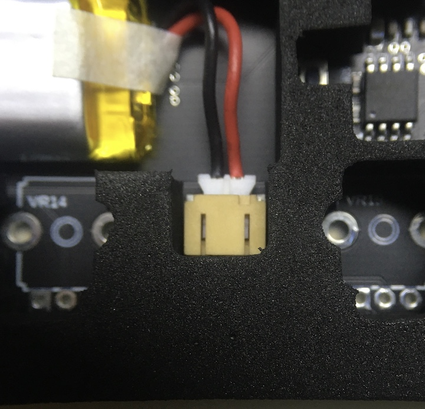
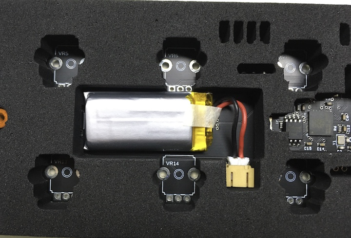

# Lipo Battery specs  

The correct battery can be sourced from Adafruit/Mouser/Digikey or other vendors.  
Adafruit: [Product #3898](https://www.adafruit.com/product/3898)   
Mouser: [485-3898](https://www.mouser.com/ProductDetail/485-3898)   
Digikey: [1528-2731-ND](https://www.digikey.com/en/products/detail/adafruit-industries-llc/3898/9685336)   

Alternates (UK):
Pimoroni: [BAT0002](https://shop.pimoroni.com/products/lipo-battery-pack?variant=20429081991) (only 150mAh)

NOTE - DON'T ORDER A RANDOM BATTERY FROM AMAZON (see below)  

Battery Specs:
* JST terminated lead  
* Not all lipos have the leads at the JST connector the same way. Check the documentation for +/- orientation. Random 3rd party batteries from Amazon appear to be wired backwards from what's needed.  
* No larger than 40mm x 19mm x 8mm  

JST Connector should have the red on the right of the raised line:

Or with red on the left when viewing the side with the metal contacts showing  

Positioning:  

You will want to remove the little piece of tape holding the wire in place (reposition on top if wanted) and then flip the battery so the text side is down.  

